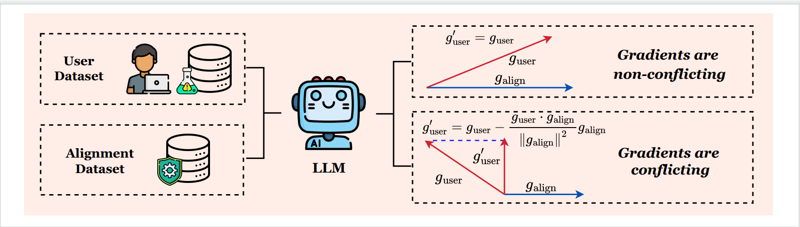

<h1 align="center">SafeGrad: Gradient Surgery for Safe LLM Fine-tuning</h1>

This repository contains the official implementation of "SafeGrad: Gradient Surgery for Safe LLM Fine-tuning" paper.

## Method Overview

Fine-tuning-as-a-Service introduces a critical vulnerability where a few malicious examples mixed into the user's fine-tuning dataset can compromise the safety alignment of Large Language Models (LLMs). While a recognized paradigm frames safe fine-tuning as a multi-objective optimization problem balancing user task performance with safety alignment, we find existing solutions are critically sensitive to the harmful ratio, with defenses degrading sharply as harmful ratio increases. We diagnose that this failure stems from conflicting gradients, where the user-task update directly undermines the safety objective. To resolve this, we propose SafeGrad, a novel method that employs gradient surgery. When a conflict is detected, SafeGrad nullifies the harmful component of the user-task gradient by projecting it onto the orthogonal plane of the alignment gradient, allowing the model to learn the user's task without sacrificing safety. To further enhance robustness and data efficiency, we employ a KL-divergence alignment loss that learns the rich, distributional safety profile of the well-aligned foundation model. Extensive experiments show that SafeGrad provides state-of-the-art defense across various LLMs and datasets, maintaining robust safety even at high harmful ratios without compromising task fidelity. 




## Data Preparation

For each downstream task, build the supervised fine-tuning dataset first:

```bash
cd sst2
python build_dataset.py
cd ../gsm8k
python build_dataset.py
cd ../ag_news
python build_dataset.py
cd ..
```


## Running the Experiments

We provide three main scripts in `script/finetune/`:

- `safegrad_posion_ratio_finetune.sh` — **SafeGrad defense** fine-tuning
- `sft.sh` — standard SFT **without defense** .


### 1. Run SafeGrad fine-tuning with harmful data

Example: harmful ratio = 0.1, 1000 samples

```bash
batch safegrad_posion_ratio_finetune.sh 0.1
```

### 2. Run baseline SFT under the same harmful ratio

```bash
batch sft.sh 0.1
```
